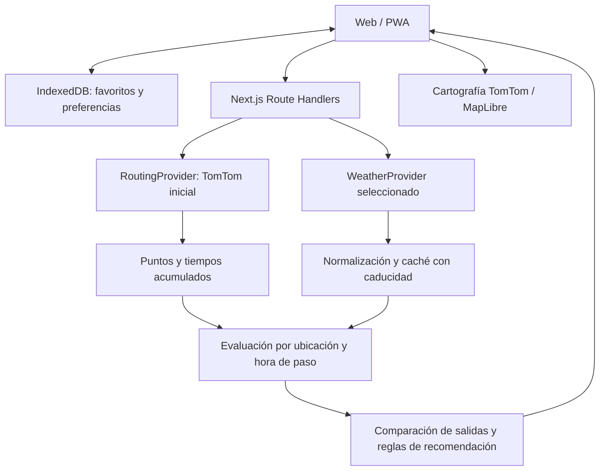

# Lluvia

Aplicación web móvil para decidir si llevar paraguas o impermeable y cuándo salir en motocicleta según la lluvia prevista durante el recorrido.

**Prioridad: disponer pronto de una aplicación instalable y útil a diario. El benchmark meteorológico se realiza en paralelo y no bloquea su desarrollo ni publicación.**

## Estado del repositorio

**A1 aceptada y desplegada en Vercel (22 de septiembre de 2026):** la app consulta Open-Meteo desde `/api/weather`, conserva los intervalos horarios y ofrece ubicación guardada, entrada manual, geolocalización, recomendación prudente, detalle horario y PWA con lectura de la última consulta sin conexión. Pasan lint, tipos, 10 pruebas y build. La primera versión verificada en [lluvia-steel.vercel.app](https://lluvia-steel.vercel.app/) fue el commit `028a972` de `main`. Tras reautorizar la conexión, se verificaron `GET /`, manifest, service worker e iconos con `200`, y consultas reales de `/api/weather` de 30, 60 y 180 minutos con datos normalizados y cobertura `ok`; no aparecieron errores de runtime en la consulta de Vercel. El usuario verificó en un teléfono la consulta vigente y la reapertura desde la app instalada sin Wi-Fi ni datos móviles: el pronóstico guardado permaneció visible, fechado y sin recomendación actual. La cuadrícula devuelta para las coordenadas iniciales está a unos 8,2 km del punto solicitado; la indicación de distancia se publicó después con A3. La precisión meteorológica local sigue sin validar.

**A2 con recorrido real en producción (22 de septiembre de 2026):** `/routes` integra routing, geocodificación, mapa, exposición horaria por tramo y favoritos con exportación/importación. El usuario configuró en Vercel dos claves TomTom separadas: servidor para Routing/Geocoding y navegador para Map Display, restringida por dominio. Tras redeploy de Production, compartió capturas del mapa con teselas y de un recorrido San Rafael–Temamatla calculado por TomTom para motocicleta: 18,2 km y 34 min. Falta comprobar la búsqueda de direcciones, los favoritos y la interfaz en teléfono. Detalle y pasos de aceptación en [A2](docs/app-plan.md#a2--recorridos-y-favoritos).

**A3 con comparación real en producción (22 de septiembre de 2026):** `/routes` compara ahora, +10, +20 y +30 minutos con rutas propias y un lote meteorológico compartido. Las capturas del recorrido San Rafael–Temamatla muestran las cuatro salidas, tiempos de 34 min, señal horaria de lluvia y sensibilidad ±5/10 min. La app evita recomendar una espera como mejor porque Open-Meteo es horario. Falta comprobar el flujo en teléfono y los cambios de ruta. Detalle en [A3](docs/app-plan.md#a3--comparación-de-salida).

**A4 publicada; aceptación operativa pendiente (22 de septiembre de 2026):** hay caché de servidor de cinco minutos para Open-Meteo horario, tope de 64 puntos meteorológicos por comparación, guardias de ráfagas por instancia, respuestas `429` con tiempo de espera y registros de latencia/resultados sin ubicaciones. La PWA usa ya la caché de interfaz v5 de A5; IndexedDB sigue en v2. El redeploy de Production con claves TomTom permitió la primera ruta y comparación reales. Faltan pruebas móviles, de favoritos, errores y cuotas. [Guía de operación y aceptación](docs/operations.md).

**A5 publicada; Weatherbit pospuesto por decisión del usuario (23 de septiembre de 2026):** Weatherbit Hourly cumple el contrato meteorológico de la app y puede seleccionarse para consulta local y rutas con `WEATHER_PROVIDER=weatherbit` y `WEATHERBIT_API_KEY` en servidor. El despliegue de Production mostrado por el usuario corresponde al código «fase A5 complete»; las capturas de la ruta indican que sigue operativo Open-Meteo. La versión A5 publicada mostraba la fuente y el evento de probabilidad; la caché de interfaz está en v5, sin migrar favoritos. Pasan lint, tipos, 26 pruebas sintéticas y build Webpack. No hay credenciales Weatherbit ni verificación de una respuesta real o de licencia. Open-Meteo seguirá como proveedor operativo; considerar otro solo tras documentar imprecisiones reales y evaluar si ofrece una mejora. [Cambio de proveedor pospuesto](docs/operations.md#cambio-de-proveedor-a5).

## Contexto y necesidades

- Zona inicial: **San Rafael, Tlalmanalco, Estado de México, México**.
- Ubicación habitual aproximada: **19.213346433905848, -98.75547014144284**.
- Zona horaria de presentación: `America/Mexico_City`; fechas internas en UTC.
- Terreno montañoso: la representatividad de las celdas meteorológicas, elevación, observaciones y cobertura de radar requiere atención especial.
- Uso cotidiano: consultar probabilidad y acumulación de lluvia por hora, desde dos horas antes hasta diez horas después de la hora actual.
- Motocicleta: analizar una ruta de aproximadamente 40 minutos en el lugar y momento de paso por cada tramo.
- Comparar salir ahora o esperar 10, 20 o 30 minutos.
- Guardar ubicaciones y rutas frecuentes y recuperarlas rápidamente.
- Experiencia principal en celular mediante web instalable como PWA.

El resultado debe ser breve y explicable. Ejemplos de mensajes, no pronósticos actuales:

> «Probabilidad baja durante la próxima hora; puedes salir sin paraguas».
>
> «Conviene llevar impermeable: se prevé lluvia en la segunda mitad del recorrido».
>
> «Esperar 20 minutos podría reducir la exposición».
>
> «Los datos disponibles no permiten distinguir claramente entre estas horas de salida».

Las recomendaciones comunicarán incertidumbre y se generarán mediante reglas verificables. No se necesita un modelo de lenguaje para redactarlas.

## Plan maestro: dos líneas independientes

| Línea | Objetivo | Plan | Dependencias |
| --- | --- | --- | --- |
| **Track A — Aplicación utilizable** | Entregar una PWA diaria con consulta local, rutas, favoritos y comparación de salidas. | [Desarrollo completo de la aplicación](docs/app-plan.md) | Un proveedor provisional operativo y los servicios requeridos por cada funcionalidad. No depende de terminar Track B. |
| **Track B — Benchmark meteorológico** | Evaluar primero Open-Meteo frente a observaciones reales locales; comparar alternativas solo si la evidencia lo justifica. | [Validación meteorológica](docs/benchmark-plan.md) | Archivo de pronósticos y observaciones. Puede ejecutarse sin la interfaz de la app. |

Los [contratos de proveedores](docs/provider-contracts.md) son el acuerdo técnico compartido. Track A consume datos normalizados; Track B evalúa adaptadores sin modificar la experiencia de uso. Compartir contratos no impone una secuencia entre tracks.

**Proveedor provisional de Track A: Open-Meteo.** Permite comenzar el piloto personal sin una clave de pago y obtener información horaria. Esta decisión prioriza disponibilidad inicial; no declara que sea el más preciso ni que proporcione nowcast fiable en San Rafael. `WEATHER_PROVIDER` seleccionará el adaptador en el servidor. El selector inicial de routing será `ROUTING_PROVIDER=tomtom`.

La UI funciona con datos horarios y explica cuándo no puede estimar inicio exacto o una ventaja por esperar. Weatherbit Hourly está implementado como alternativa, pero su activación quedó pospuesta; OpenWeather continúa como candidato sin adaptador de aplicación.

## Stack y decisiones

| Área | Recomendación | Motivo y límites | Alternativas / etapa |
| --- | --- | --- | --- |
| Frontend | Next.js App Router + React + TypeScript | Un proyecto para interfaz y API; tipos compartidos. Requiere respetar límites servidor/cliente. | Vite + API separada o SvelteKit. MVP. |
| UI | Tailwind CSS + componentes seleccionados de shadcn/ui, base Radix | Controles accesibles y adaptables; los componentes copiados requieren mantenimiento propio. | CSS Modules. MVP. |
| Mapa | MapLibre GL JS + cartografía TomTom | Capas y tramos coloreados; MapLibre no incluye alojamiento de mapas ni cálculo de rutas. | MapTiler, Mapbox o Leaflet. MVP. |
| Routing | TomTom detrás de `RoutingProvider` | Geometría y tiempos acumulados; validar cobertura y perfil de moto, documentado como beta. | Mapbox Directions u openrouteservice. MVP. |
| Direcciones | TomTom Geocoding y selección manual | Un proveedor geográfico inicial; comprobar calidad y licencia de almacenamiento. | Otros geocodificadores; Places Search si hace falta buscar negocios. MVP. |
| Geolocalización | API del navegador | HTTPS y permiso explícito; alternativa manual si falla o es imprecisa. | SDK nativo si cambia el alcance. MVP. |
| Clima | `WeatherProvider` intercambiable | Open-Meteo provisional; comparar también OpenWeather y Weatherbit. | Selección basada en evidencia posterior. MVP. |
| Backend | Route Handlers de Next.js, runtime Node.js, `fetch` y Zod | Claves privadas, validación de respuestas, límites y evaluación del recorrido. | FastAPI/NestJS solo si surge una necesidad independiente. MVP. |
| Persistencia | IndexedDB mediante `idb` | Favoritos y preferencias locales, sin cuentas; no sincroniza y puede borrarse. Incluir exportación/importación. | PostgreSQL/Supabase para sincronización futura. MVP local. |
| Autenticación | Ninguna en el MVP | Menos fricción; no es necesaria para favoritos en un dispositivo. | Supabase Auth cuando exista sincronización. |
| Instalación | Manifest y service worker pequeño | Una PWA para consulta antes de salir; capacidades e instalación varían por navegador. | Capacitor/React Native si se necesita seguimiento con pantalla apagada. MVP. |
| Visualización | Recharts y capas GeoJSON de MapLibre | Series pequeñas y relación mapa/tiempo; acompañar colores con texto. | SVG simple o ECharts. MVP. |
| Hosting | Vercel | HTTPS y despliegue integrado de Next.js; revisar condiciones y consumo. | Node.js en Render/Railway o Cloudflare con su integración. MVP. |
| Procesamiento periódico | Ninguno para consultas manuales | Actualización bajo demanda y caché explícita. | Alertas futuras con programador y, solo si hace falta, cola. Recolector independiente para Track B. |
| Verificación | Vitest + Playwright | Pruebas de contratos, unidades, tiempo y flujos críticos en móvil. | Las pruebas no demostrarán precisión meteorológica. Durante implementación. |

`package.json` y `package-lock.json` declaran la base técnica; shadcn/ui se integrará copiando solo los componentes necesarios con su CLI. A0 no necesita todavía componentes shadcn/ui, mapas ni gráficas. No existe una dependencia de runtime llamada «shadcn/ui». PWA, routing y meteorología utilizarán APIs web/HTTP, sin SDKs obligatorios ni paquetes de base de datos o autenticación.

## Arquitectura del flujo de datos

1. Obtener origen, destino, puntos intermedios y hora de salida.
2. Consultar la geometría real y los tiempos acumulados; no asumir velocidad constante.
3. Muestrear inicialmente cada 3–5 minutos de viaje y ajustar por distancia, relieve y resolución disponible.
4. Asignar a cada punto la hora de salida más su tiempo acumulado.
5. Consultar series que cubran las ubicaciones y las alternativas; reutilizarlas cuando sea válido.
6. Calcular exposición estimada y sensibilidad a cambios en el tiempo de viaje.
7. Mostrar recomendación, mapa, gráfica, probabilidades del proveedor, fuente, antigüedad y limitaciones.

La caché HTTP del pronóstico crudo distingue endpoint, producto, coordenadas y parámetros de consulta; la versión del adaptador viaja en la respuesta normalizada. El TTL respeta la vigencia de 20 minutos de la app y debe revisarse frente a la licencia. La memoria de una función serverless no será almacenamiento compartido garantizado. Redis no es una dependencia inicial.

## Reglas de interpretación meteorológica

- Un intervalo de salida de un minuto no demuestra precisión de un minuto ni de una calle.
- Probabilidad, intensidad y acumulación son variables distintas. Conservar unidades y periodo de validez.
- No sumar probabilidades de tramos ni aplicar `1 - producto(1 - p)` asumiendo independencia: una tormenta puede afectar varios tramos.
- Una categoría propia de exposición no se publicará como porcentaje de «probabilidad de mojarse».
- La probabilidad horaria no se copiará como si fuera probabilidad por minuto.
- La duración de la lluvia en un punto y los minutos de exposición durante un recorrido son resultados distintos.
- Datos ausentes o vencidos nunca significan «no va a llover». Tampoco se anunciará fin de lluvia fuera del horizonte.
- Usar UTC internamente; distinguir intervalos precedentes y siguientes de cada API.
- No reducir diferencias de relieve a una corrección arbitraria por elevación.
- Menor exposición prevista a lluvia no equivale a una ruta segura: pavimento mojado, inundación y viento requieren información adicional.

| Salida para un viaje de 40 minutos | Horizonte mínimo desde la consulta |
| --- | --- |
| Ahora | 40 minutos |
| +10 minutos | 50 minutos |
| +20 minutos | 60 minutos |
| +30 minutos | 70 minutos |

Estos valores no incluyen antigüedad del pronóstico ni retrasos. Un nowcast de 60 minutos no cubre toda la última alternativa. Si se usa información horaria para completar el recorrido, se señalará el cambio de resolución y podrá omitirse la recomendación de espera.

## Proveedores candidatos y limitaciones conocidas

| Proveedor | Datos a evaluar | Condición relevante |
| --- | --- | --- |
| Open-Meteo | Probabilidad, acumulación e intensidad media horarias; `best_match` inicial | Los 15 minutos pueden ser interpolación de horas. No asumir HRRR en San Rafael; comprobar modelo y variable. La probabilidad documentada puede proceder de ensembles de unos 27 km. |
| OpenWeather One Call | Minutos para 60 minutos, series de 15 minutos y horarias según producto | Intensidad minutely no equivale a probabilidad minutely. Validar disponibilidad local y costes por punto/endpoint. |
| Weatherbit | Nowcast de 60 minutos y pronóstico horario | Publica refresco típico de 5–10 minutos y resolución típica próxima a 1 km dependiente del radar; no es una cobertura local comprobada. |

La comparación se hará frente a lluvia observada, no frente al «tiempo actual» del propio proveedor. El diseño completo, métricas y archivo experimental están exclusivamente en [Track B](docs/benchmark-plan.md).

Tomorrow.io queda como alternativa futura si estos candidatos no bastan; su pronóstico minutely requiere acceso premium en Forecast. RainViewer no será el proveedor de pronóstico futuro: retiró ese producto de su API el 1 de enero de 2026.

## MVP y evolución

El MVP incluye consulta local, recomendaciones prudentes, rutas de 40 minutos, comparación de cuatro salidas con estado «sin diferencia evaluable», favoritos, exportación/importación y PWA móvil. Debe gestionar permisos denegados, falta de cobertura, cuotas, fallos y datos antiguos.

Después se podrán añadir sincronización con PostgreSQL/Supabase, autenticación, alertas, radar con licencia adecuada, rutas alternativas, personalización y capacidades nativas. Una promoción de proveedor puede ocurrir antes o después de esas mejoras; no obliga a rehacer la UI, el almacenamiento ni el motor del recorrido.

## Servicios, cuotas y presupuesto

Referencias consultadas el **22 de septiembre de 2026**, sujetas a cambios. No son garantías de gasto ni de disponibilidad.

| Servicio | Referencia | Consecuencia |
| --- | --- | --- |
| Vercel | Hobby personal no comercial; Pro desde 20 USD/mes más consumo aplicable | Prototipo personal potencialmente gratuito; revisar plan al cambiar uso. |
| TomTom | Publica 20.000 consultas/mes gratuitas de rutas y de geocodificación, y 200.000 tiles para productos indicados | Una vista del mapa carga varios tiles. Comprobar producto y condiciones al contratar. |
| Open-Meteo | Acceso gratuito no comercial hasta 10.000 llamadas/día, con otros límites | Adecuado para inicio personal; uso comercial requiere plan/licencia correspondiente. |
| OpenWeather | One Call publica 1.000 llamadas/día gratuitas y exceso facturable | Varios puntos y endpoints multiplican consumo. Configurar límite de gasto. |
| Weatherbit | Plan Free permanente: pronóstico diario y tiempo actual, sin Hourly Forecast. Prueba de 21 días para funciones de pago, hasta 1.500 solicitudes/día. | El adaptador A5 requiere Hourly Forecast y la app guarda una copia local: para operación continua se necesita un plan de pago y licencia de almacenamiento; la prueba no habilita por sí sola esa copia. [Precios](https://www.weatherbit.io/pricing), [almacenamiento](https://help.weatherbit.io/faq/can-i-store-data-retrieved-from-the-api-locally/). |
| Supabase futuro | Free; Pro desde 25 USD/mes | No necesario para el MVP. |

Ejemplo: 12 puntos por 3 endpoints son 36 llamadas por análisis antes de caché; 100 análisis serían 3.600 llamadas. Comparar salidas puede reutilizar series, pero consultar actualizaciones vuelve a consumir cuota. Los lotes HTTP no garantizan una sola unidad facturable.

Guardar rutas significa conservar intención del usuario: nombre, origen, destino, puntos intermedios y preferencias. Las geometrías y resultados de geocodificación de terceros se almacenarán solo según licencia. Los mapas también requieren atribución. Las claves privadas permanecerán en servidor; una clave pública de cartografía debe restringirse al dominio y servicio permitido.

## Consulta local de A1

- `npm run dev` abre la app; `GET /api/weather?lat=19.213346&lon=-98.755470&view=hourly` devuelve trece horas de pronóstico, de −2 a +10 respecto de la hora actual. El endpoint conserva `minutes=30–360` para consultas de duración explícita. La portada muestra la tabla horaria sin selector de periodo: la hora actual tiene un fondo tenue y el cambio de día se indica con `(dd/mm)` dentro de la primera celda «Hora» del nuevo día. `WEATHER_PROVIDER=open-meteo` es la selección inicial.
- El adaptador usa el pronóstico horario automático `best_match`, `timezone=UTC`, probabilidad de más de 0.1 mm en la hora precedente y acumulación de esa hora. La tasa `mm/h` es la media derivada de la acumulación horaria. No se conocen la hora de emisión, el modelo efectivo por variable ni la resolución espacial de la respuesta; el contrato conserva estas limitaciones, aunque la tabla local actual no las detalla. [Definición oficial de variables horarias](https://open-meteo.com/en/docs#hourly_parameter_definition).
- La columna «Qué esperar» traduce la acumulación horaria a una intensidad media orientativa: lluvia ligera (<2.5 mm), moderada (2.5–<10 mm), fuerte (10–<50 mm) o muy intensa (≥50 mm). Cada estado se acompaña de un icono y texto: «Sin lluvia prevista» es positivo, «Lluvia muy intensa» es una alerta y «Sin dato» permanece neutral. Los límites se inspiran en la [guía de la OMM](https://www.weather.gov/media/epz/mesonet/CWOP-WMO8.pdf), cuya clasificación original usa mediciones de tres minutos; la app no infiere truenos, picos de intensidad ni tipo de precipitación a partir de los mm por hora.
- La interfaz parte del tema `neutral` oscuro de [shadcn/ui](https://ui.shadcn.com/docs/theming) y usa colores semánticos para el pronóstico y un tono discreto para la hora actual; el mapa usa equivalentes sRGB de sus tokens de gráficos.
- IndexedDB `lluvia-local`, versión 2, guarda ubicaciones, ubicación seleccionada y último pronóstico horario por ubicación. La vista local actual no presenta una recomendación de salida; una consulta anterior se muestra fechada y no resalta una hora como actual. El límite de vigencia usado por A1 es de 20 minutos; el navegador consulta la red para actualizar. La geolocalización requiere un gesto explícito y se rechaza si declara precisión peor que ±500 m.
- El manifest, iconos PNG y `public/sw.js` permiten la instalación. El service worker guarda la interfaz y recursos estáticos, pero excluye `/api/`. En iPhone se usa **Compartir → Añadir a pantalla de inicio**. La instalación y reapertura sin conexión se comprobaron en el teléfono del usuario para aceptar A1.
- Variables opcionales: `OPEN_METEO_API_KEY` y `OPEN_METEO_BASE_URL`. El endpoint solo admite HTTPS y los hosts `api.open-meteo.com` o `customer-api.open-meteo.com` con ruta `/v1/forecast`; la clave permanece en el servidor. El uso comercial requiere el endpoint y la licencia que correspondan.

### Validación de A1 y seguimientos

1. **Comprobado en producción:** la API devolvió datos horarios reales para San Rafael con `status: ok`, `Cache-Control: no-store` y sin claves en el JSON normalizado; esto confirma cobertura técnica, no precisión local. El proyecto Vercel es `minnicas-projects/lluvia` (`prj_zwc1D30xrA4xkxGGQA3BkKmcbC7E`); el despliegue verificado es `dpl_73WbB2Pmyxck28bS2xnqFJ3HiDfc` del commit `028a972`.
2. **Comprobado por el usuario en Android:** tras una consulta en línea, cerró la app, apagó Wi-Fi y datos móviles y la reabrió desde el icono. Las capturas muestran la consulta inicial con recomendación y, después, «Pronóstico anterior, sin recomendación actual», con fecha de consulta y detalle horario aún visible. Esto satisface la aceptación móvil de A1; las capturas fueron compartidas en la conversación y no se guardan en el repositorio.
3. **Seguimientos:** repetir `npm ci` con acceso estable al registro; revisar en teléfono la alternativa de coordenadas manuales tras denegar geolocalización y la persistencia de ubicaciones guardadas. La indicación de distancia se publicó con A3. Estas comprobaciones adicionales pueden realizarse durante A4.

## Recorridos de A2

- Abre `/routes` o «Consultar un recorrido» desde la portada. Elige lugares guardados para origen, destino y paradas, o pega cada par `latitud, longitud` en un solo campo. Puedes guardar nuevos lugares desde el editor y, con claves configuradas, buscar direcciones o elegir puntos en el mapa. Selecciona motocicleta (beta de TomTom) o automóvil y preferencias de vías. «Comparar cuatro salidas» calcula rutas con tiempos acumulados y consulta Open-Meteo en los puntos de paso. Muestra cada tramo y su hora, señal horaria, cobertura y distancia a la cuadrícula. Las franjas coloreadas y la lista son seleccionables entre sí. Sin `TOMTOM_API_KEY`, la consulta local de A1 sigue funcionando.
- Guarda favoritos en IndexedDB v2; abrir uno recalcula routing y clima. Puedes exportarlos a `lluvia-routes` JSON v1 e importarlos; se valida el archivo completo, se omiten duplicados y se renuevan IDs en conflicto. Se guardan solo puntos y preferencias del usuario, no geometría ni pronósticos. Los resultados de búsqueda de TomTom requieren confirmación sobre el mapa o ajuste manual antes de guardarse.
- Configura `TOMTOM_API_KEY` **solo en servidor** para routing y geocodificación. Configura `NEXT_PUBLIC_TOMTOM_MAP_KEY` para teselas en el navegador, restringida por dominio y producto. Consulta [.env.example](.env.example). Si falta la clave del mapa, puedes usar coordenadas manuales; si falta la clave privada, se informa el error al intentar analizar. La clave privada no se envía a la UI.
- La PWA guarda `/routes` como interfaz para ver favoritos sin red; mapa, cálculo y clima necesitan conexión. Un análisis de más de 20 minutos se marca como anterior. El muestreo de 4 minutos no convierte un pronóstico horario en uno por minuto, y el relieve aún no se ajusta por falta de elevación fiable por tramo.

## Comparación de A3

- «Comparar cuatro salidas» calcula rutas TomTom para ahora, +10, +20 y +30 minutos desde una misma decisión. Si cambia la geometría o los tiempos, la tarjeta lo indica y el mapa y los tramos muestran la alternativa elegida. Si falla una ruta futura, se conserva su error y no se la sustituye silenciosamente.
- Las ubicaciones de paso repetidas comparten una consulta meteorológica; cada punto obtiene horas que cubren todas las salidas y un margen ±10 minutos. Para 40 minutos de viaje y 30 de espera se requieren al menos 80 minutos de cobertura desde la decisión, más antigüedad conocida del dato. Si falta cobertura continua, el estado es insuficiente. La hora de emisión del modelo Open-Meteo sigue siendo desconocida.
- Los minutos presentados son minutos de trayecto que cruzan horas con señal, no minutos realmente bajo lluvia. Los escenarios ±5/10 minutos muestran sensibilidad de la hora de paso y no son confianza estadística. Con las series horarias actuales la app no selecciona una salida como mejor ni suma probabilidades del trayecto.

## Cambio de proveedor A5

- **Decisión del 23 de septiembre de 2026:** no activar ni contratar Weatherbit por ahora. Mantener Open-Meteo y registrar observaciones de lluvia real frente a los pronósticos antes de decidir si hace falta evaluar otro proveedor; una diferencia observada no demuestra por sí sola que Weatherbit sea más preciso.
- La configuración `WEATHER_PROVIDER` admite `open-meteo` (predeterminado) y `weatherbit`. Weatherbit requiere `WEATHERBIT_API_KEY` privada y acceso al producto Hourly Forecast, que no figura en su plan Free permanente. La app guarda el último pronóstico en IndexedDB y usa caché de servidor; [Weatherbit exige una suscripción de pago activa para almacenar sus datos](https://help.weatherbit.io/faq/can-i-store-data-retrieved-from-the-api-locally/). Ambos endpoints meteorológicos usan el mismo contrato y los favoritos no cambian. El producto Weatherbit horario tampoco permite distinguir por sí solo una espera de diez minutos; el umbral de su probabilidad se muestra como desconocido.
- El adaptador Weatherbit solo se ha probado con respuestas sintéticas. Antes de activarlo en producción hay que contrastar la semántica de los intervalos y la cobertura real en San Rafael, verificar licencia/cuotas y completar la [prueba de preview y rollback](docs/operations.md#cambio-de-proveedor-a5). El benchmark independiente sigue sin resultados.

## Preparación técnica

- Entorno previsto: Node.js 22.13+ de la rama 22 o Node.js 24, npm 10+.
- `package-lock.json` fija las dependencias. En este entorno, npm 10.9.8 falló internamente al resolver peers; se generó el lockfile en un directorio limpio con `--legacy-peer-deps` y se comprobó la compatibilidad de peers por separado con `pnpm install --strict-peer-dependencies --frozen-lockfile`. La red impidió completar una instalación limpia con `npm ci`; repetirla en un entorno con acceso estable al registro.
- En la copia A5, `npm run lint`, `npm run typecheck`, `npm test` (26 pruebas) y `npm run build` pasan con dependencias locales. Ejecutar build aislado de tipos: el primer build tras los controles volvió a fallar transitoriamente al leer `tsc --showConfig`; repetirlo aislado pasó. Build usa `next build --webpack`: Turbopack falló antes en este sandbox al intentar abrir un puerto interno para procesar CSS. `npm ci --offline` no terminó antes porque falta `picomatch` en caché; repetir con red. `next start` estuvo bloqueado por `listen EPERM`, así que la automatización de navegador para A2–A5 está pendiente; la prueba manual en Android corresponde a A1.
- Los contratos y factorías están en `src/domain` y `src/server/providers`; los adaptadores Open-Meteo y Weatherbit están en `src/server/providers/weather/`. Los fixtures de prueba son sintéticos y nunca se presentan como pronóstico real.
- Siguiente paso: completar la [aceptación móvil y operativa de A2–A4](docs/operations.md#aceptación-pendiente) con búsqueda, favoritos, paradas, comparación, PWA sin red, estados de error y cuotas. El mapa y la ruta real ya funcionan en producción. Validar A5 con acceso y licencia Weatherbit en preview solo si se decide usar ese proveedor.

Las variables y contratos previstos se describen en [Track A](docs/app-plan.md) y [contratos compartidos](docs/provider-contracts.md). La ruta habitual y el tipo de observación local del benchmark siguen pendientes; no impiden comenzar la consulta local ni un editor genérico de rutas.

## Fuentes

- [Next.js: instalación](https://nextjs.org/docs/app/getting-started/installation), [PWA](https://nextjs.org/docs/app/guides/progressive-web-apps) y [shadcn/ui](https://ui.shadcn.com/docs/installation/manual).
- [MapLibre](https://maplibre.org/maplibre-gl-js/docs/), [TomTom Routing](https://docs.tomtom.com/routing-api/documentation/tomtom-maps/v1/calculate-route) y [precios TomTom](https://docs.tomtom.com/pricing).
- [Open-Meteo: variables](https://open-meteo.com/en/docs), [GFS/HRRR](https://open-meteo.com/en/docs/gfs-api) y [planes](https://open-meteo.com/en/pricing).
- [OpenWeather One Call](https://openweathermap.org/api/one-call-4) y [precios](https://openweathermap.org/price).
- [Weatherbit Minutely](https://www.weatherbit.io/api/weather-forecast-minutely), [Hourly](https://www.weatherbit.io/api/weather-forecast-hourly) y [planes/retención](https://www.weatherbit.io/pricing).
- [Tomorrow.io Forecast](https://docs.tomorrow.io/reference/weather-forecast) y [cambios de RainViewer](https://www.rainviewer.com/api/transition-faq.html).
- [Vercel](https://vercel.com/pricing), [Hobby](https://vercel.com/docs/plans/hobby), [Supabase](https://supabase.com/pricing).
- [SMN SIVEA](https://smn.conagua.gob.mx/tools/PHP/sivea_v3/div.php), [NOAA: radar y relieve](https://inside.nssl.noaa.gov/nsslnews/2009/09/nssls-mobile-radar-collects-data-on-summer-storms-in-the-colorado-mountains/).
- [Geolocalización](https://developer.mozilla.org/en-US/docs/Web/API/Geolocation_API), [IndexedDB](https://developer.mozilla.org/en-US/docs/Web/API/IndexedDB_API), [licencias de geocodificación: ejemplo Mapbox](https://docs.mapbox.com/api/search/geocoding/).
